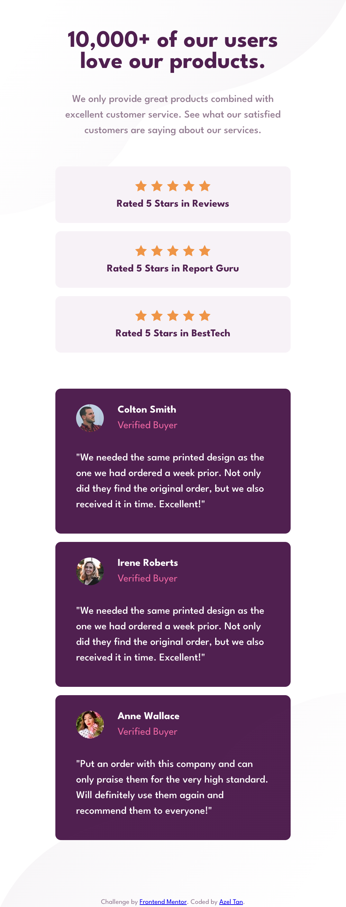
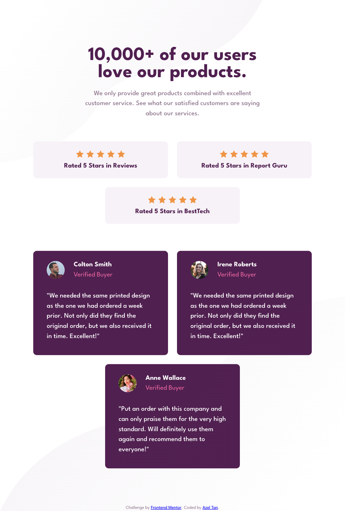
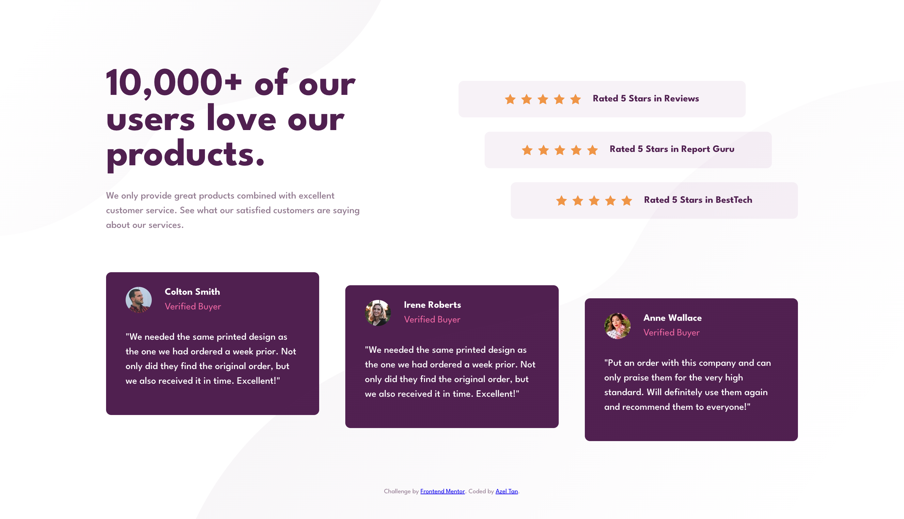

# Frontend Mentor - Social proof section solution

This is a solution to the [Social proof section challenge on Frontend Mentor](https://www.frontendmentor.io/challenges/social-proof-section-6e0qTv_bA). Frontend Mentor challenges help you improve your coding skills by building realistic projects. 

## Table of contents

- [Overview](#overview)
  - [The challenge](#the-challenge)
  - [Screenshot](#screenshot)
  - [Links](#links)
- [My process](#my-process)
  - [Built with](#built-with)
  - [What I learned](#what-i-learned)
- [Author](#author)

**Note: Delete this note and update the table of contents based on what sections you keep.**

## Overview

### The challenge

Users should be able to:

- View the optimal layout for the section depending on their device's screen size

### Screenshot

- Screenshot for Mobile screen

- Screenshot for Tablet screen

- Screenshot for Desktop screen

### Links

- Solution URL: [Github repository](https://github.com/azelalynetan/azel.frontend-mentor--social-proof-section)
- Live Site URL: [Github page](https://azelalynetan.github.io/azel.frontend-mentor--social-proof-section)

## My process

### Built with

- Semantic HTML5 markup
- Mobile-first workflow
- CSS Variables
- Flexbox
- CSS Grid

### What I learned

I was able to practice and play responsive design with CSS Grid and Flexbox.

## Author

- Website - [azelalynetan](https://azelalynetan.github.io/)
- Frontend Mentor - [@azelalynetan](https://www.frontendmentor.io/profile/azelalynetan)
